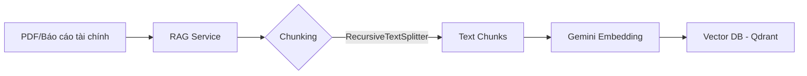
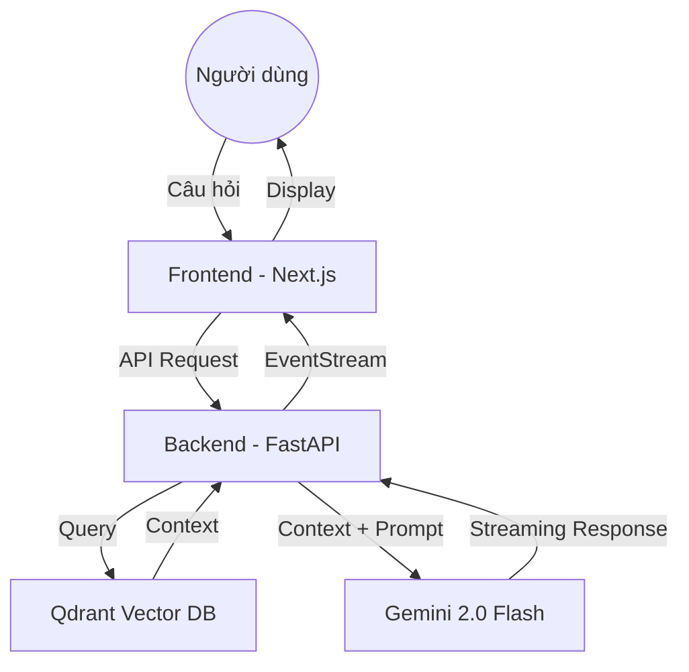

# AI Finance Assistant - System Specification (Source of Truth)

Tài liệu này đóng vai trò là nguồn sự thật duy nhất (Source of Truth) cho dự án AI Finance Assistant, chi tiết hóa kiến trúc, luồng dữ liệu và các tính năng cốt lõi.

## 1. Tổng quan Hệ thống
AI Finance Assistant là một nền tảng tư vấn tài chính thông minh, kết hợp sức mạnh của LLM (Gemini 2.0) với dữ liệu thực tế từ các tài liệu tài chính cá nhân (RAG).

### Công nghệ lõi (Tech Stack)
- **Frontend**: Next.js (App Router), Tailwind CSS, Assistant-UI (ChatGPT-like UX).
- **Backend**: FastAPI (Python), LangChain.
- **AI Models**: Google Gemini 2.0 Flash (Inference), text-embedding-004 (Embeddings).
- **Database**: 
  - **Relational**: Supabase (PostgreSQL) - Lưu trữ user, profile, transactions.
  - **Vector Storage**: Qdrant - Lưu trữ kiến thức từ PDF/Doc cho RAG.

---

## 2. Luồng dữ liệu (Data Flow)

### 2.1 Luồng Nạp dữ liệu (Ingestion Flow)
Đây là cách hệ thống "học" từ các tài liệu PDF tài chính.

### 2.2 Luồng Hội thoại (Chat Flow)
Cách người dùng tương tác với AI và nhận phản hồi có dữ liệu thực tế.

---

## 3. Các Tính năng Chính

### 3.1 AI financial Advisor (Chatbot)
- Giao diện hiện đại, hỗ trợ streaming (trả lời từng chữ).
- Khả năng ghi nhớ ngữ cảnh hội thoại.
- Hỗ trợ gửi file và phân tích trực tiếp.

### 3.2 RAG (Retrieval-Augmented Generation)
- Tự động trích xuất thông tin từ sao kê ngân hàng, báo cáo tài chính (PDF).
- Truy vấn ngữ nghĩa (Semantic Search) để trả lời chính xác dựa trên dữ liệu người dùng cung cấp thay vì trả lời chung chung.

### 3.3 Tài chính Cá nhân (Finance Core)
- Quản lý danh mục đầu tư.
- Theo dõi thu chi và phân tích xu hướng.
- Dự báo tài chính dựa trên dữ liệu lịch sử.

---

## 4. Cấu trúc Schema (Pydantic)
Mọi dữ liệu trao đổi qua API đều được chuẩn hóa bằng Pydantic để đảm bảo tính an toàn.

- **Request Schema**: Kiểm soát dữ liệu người dùng gửi lên (Chat request, File upload).
- **Response Schema**: Định dạng dữ liệu trả về cho Frontend (Message, Analysis Results).
- **State Schema**: Quản lý trạng thái Agent để xử lý các tác vụ phức tạp theo nhiều bước.

---

## 5. Quy trình Vận hành (Operations)
1. **Khởi tạo**: Setup môi trường Backend (Poetry/Pip) và Frontend (NPM).
2. **Nạp dữ liệu**: Upload PDF -> Hệ thống tự động xử lý và lưu vào Qdrant.
3. **Tương tác**: Người dùng hỏi về tài chính cá nhân -> AI truy xuất dữ liệu từ Qdrant -> Gemini tổng hợp câu trả lời.

> [!IMPORTANT]
> Toàn bộ logic AI và xử lý dữ liệu nặng được thực hiện ở Backend (FastAPI) để tối ưu hiệu năng. Frontend chỉ đóng vai trò hiển thị và quản lý Runtime UI.
