# Agent Architecture Overview - AI Finance Assistant

## 1. Kién trúc Tong quan

He thong Agent duoc thiet ke theo mo hinh **Multi-Agent Orchestration** voi 3 thanh phan chinh:

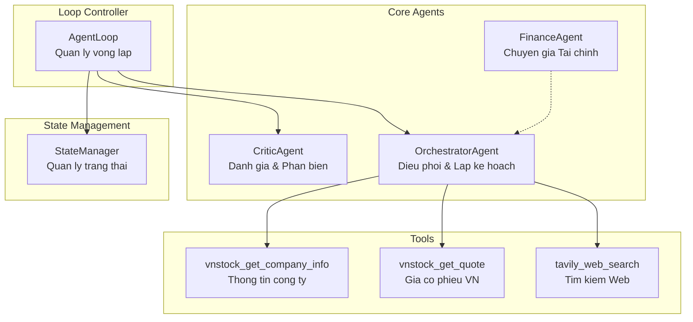

---

## 2. Luong Hoat dong Chinh - Agent Loop

Luong hoat dong duoc dieu phoi boi [`AgentLoop`](src/agents/agent_loop.py:51):

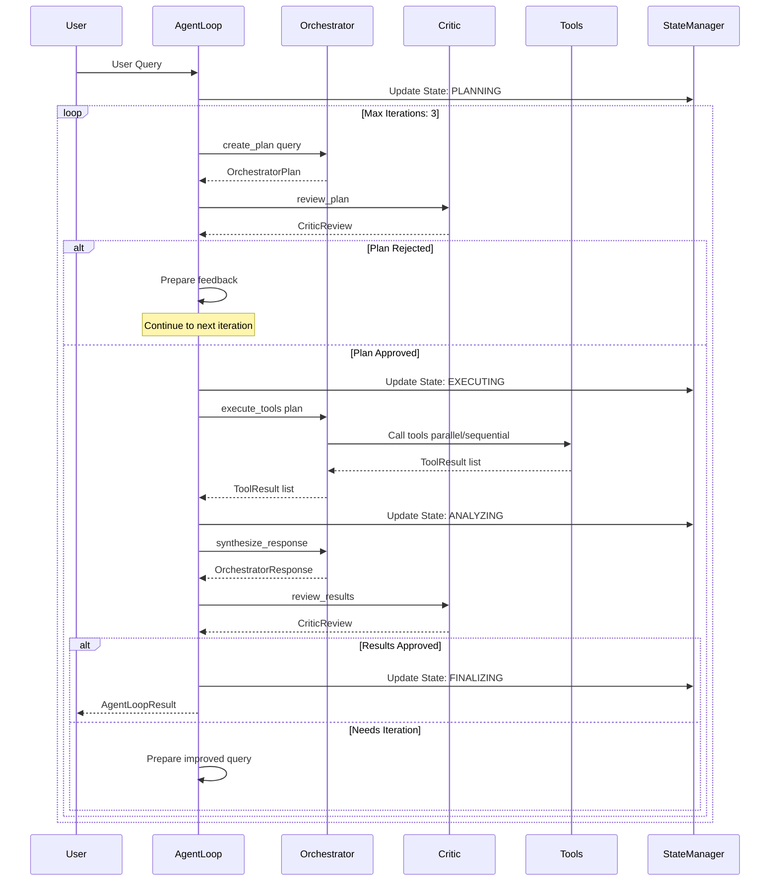

---

## 3. Chi tiet tung thanh phan

### 3.1 BaseAgent - Lop co so

[`BaseAgent`](src/agents/base.py:7) la lop cha cho tat ca cac Agent:

```python
class BaseAgent:
    def __init__(self, system_prompt, model_name, tools):
        self.system_prompt = system_prompt      # Huong dan cho AI
        self.model_name = model_name            # Gemini model
        self.tools = tools                      # Danh sach tools
        self.model = genai.GenerativeModel(...) # Gemini client
        self.chat_session = None                # Session chat
        self.total_tokens = 0                   # Token tracking
```

**Chuc nang chinh:**
- Quan ly ket noi LLM (Google Gemini)
- Tracking token usage
- Quan ly chat history

---

### 3.2 OrchestratorAgent - Dieu phoi chinh

[`OrchestratorAgent`](src/agents/orchestrator.py:73) la "bo nao" cua he thong:

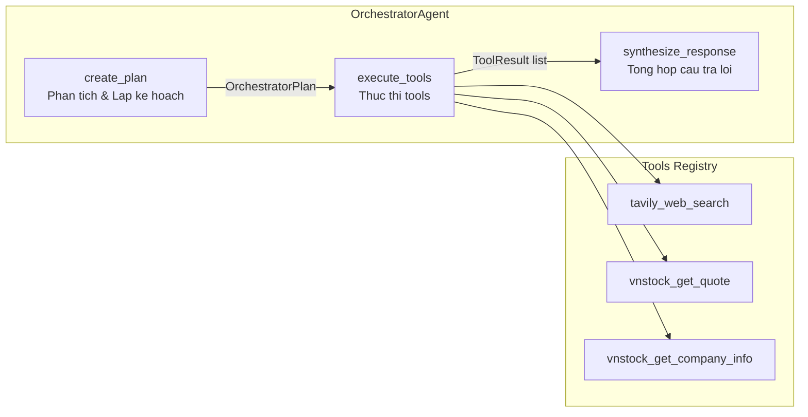

**Data Models:**

| Model | Mo ta |
|-------|-------|
| [`ToolPlan`](src/agents/orchestrator.py:24) | Ke hoach thuc thi 1 tool: tool_name, parameters, reason, priority |
| [`OrchestratorPlan`](src/agents/orchestrator.py:35) | Ke hoach day du: original_query, interpreted_intent, tools[], can_parallel |
| [`ToolResult`](src/agents/orchestrator.py:49) | Ket qua thuc thi: tool_name, success, result, execution_time, error |
| [`OrchestratorResponse`](src/agents/orchestrator.py:59) | Phan hoi cuoi: synthesized_answer, needs_iteration |

**Logic lap ke hoach:**
1. Nhan user query
2. Goi Gemini de phan tich intent
3. Chon tools phu hop tu registry
4. Tra ve JSON plan

**Logic thuc thi tools:**
- Neu `can_parallel = true`: Thuc thi song song voi `asyncio.gather()`
- Neu `can_parallel = false`: Thuc thi tuan tu

---

### 3.3 CriticAgent - Phan bien & Danh gia

[`CriticAgent`](src/agents/critic.py:39) dam bao chat luong:

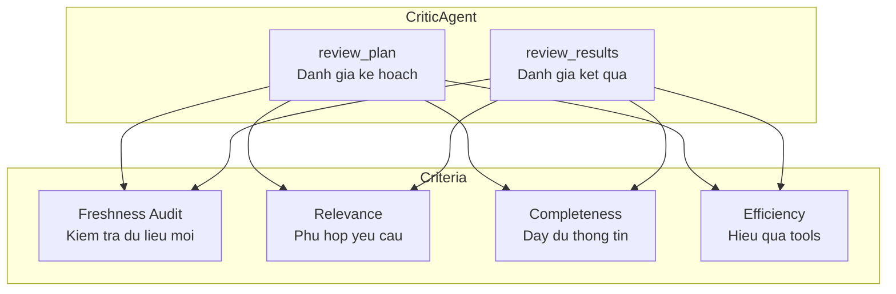

**CriticReview Model:**

| Field | Type | Mo ta |
|-------|------|-------|
| approved | bool | Phe duyet hay khong |
| score | float 0-10 | Diem chat luong |
| reasoning | str | Ly do chi tiet |
| concerns | list | Danh sach van de |
| suggestions | list | Goi y cai thien |
| requires_changes | bool | Can thay doi |
| iteration_feedback | str | Huong dan iteration tiep |

**Nguyen tac quan trong - Freshness Audit:**
> "No Old Knowledge" - Doi voi du lieu tai chinh, kien thuc cu training data la vo gia tri. Chi chap nhan thong tin tu Tools.

---

### 3.4 AgentLoop - Vong lap chinh

[`AgentLoop`](src/agents/agent_loop.py:51) dieu phoi toan bo workflow:

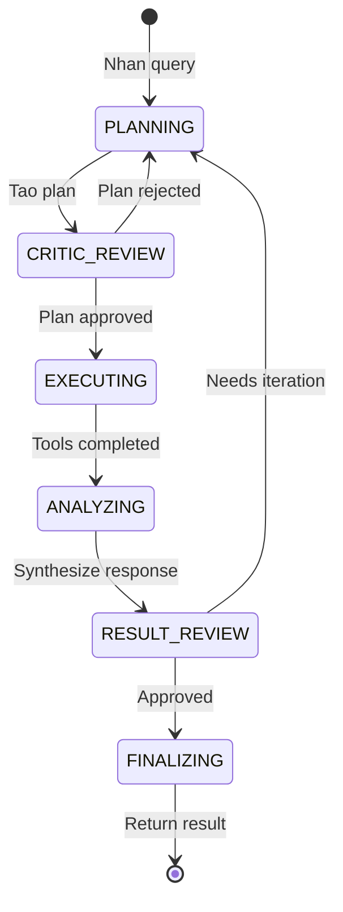

**AgentLoopConfig:**

| Parameter | Default | Mo ta |
|-----------|---------|-------|
| max_iterations | 3 | So lan lap toi da |
| require_critic_approval | true | Can Critic phe duyet |
| parallel_tool_execution | true | Thuc thi tools song song |
| timeout_seconds | 60.0 | Thoi gian timeout |

**Progress Callback Stages:**
1. `start` - Bat dau xu ly
2. `iteration_start` - Bat dau 1 vong lap
3. `planning` - Orchestrator dang lap ke hoach
4. `plan_created` - Ke hoach da tao
5. `critic_review` - Critic dang danh gia
6. `plan_reviewed` - Danh gia xong
7. `plan_rejected` - Ke hoach bi tu choi
8. `executing` - Dang thuc thi tools
9. `tools_completed` - Tools hoan thanh
10. `synthesizing` - Dang tong hop
11. `response_ready` - Phan hoi san sang
12. `result_review` - Critic danh gia ket qua
13. `completed` - Hoan thanh

---

### 3.5 StateManager - Quan ly trang thai

[`StateManager`](src/agents/state/manager.py:18) luu tru trang thai session:

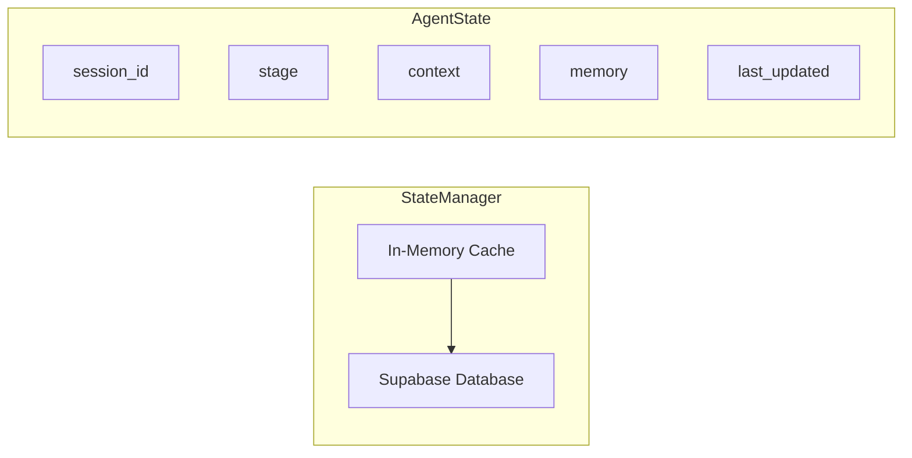

**AgentStage Enum:**
- `IDLE` - Cho doi
- `PLANNING` - Dang lap ke hoach
- `EXECUTING` - Dang thuc thi
- `ANALYZING` - Dang phan tich
- `FINALIZING` - Dang hoan thanh

---

## 4. Tools - Cong cu

### 4.1 Tavily Web Search

[`tavily_web_search`](src/agents/tools/tavily_search.py) - Tim kiem web toi uu cho AI:

```python
# Parameters
query: str              # Tu khoa tim kiem
search_depth: str       # basic, advanced, fast, ultra-fast
max_results: int        # So luong ket qua
recency_days: int       # Loc theo thoi gian
```

### 4.2 VNStock Tools

[`vnstock_get_quote`](src/agents/tools/vnstock_tool.py) - Lay gia co phieu VN:
```python
# Parameters
symbol: str  # Ma co phieu: VCB, VNM, VIC...
```

[`vnstock_get_company_info`](src/agents/tools/vnstock_tool.py) - Thong tin cong ty:
```python
# Parameters
symbol: str  # Ma co phieu
```

---

## 5. Vi du Luong Hoat dong

**User Query:** "Phan tich co phieu VCB"

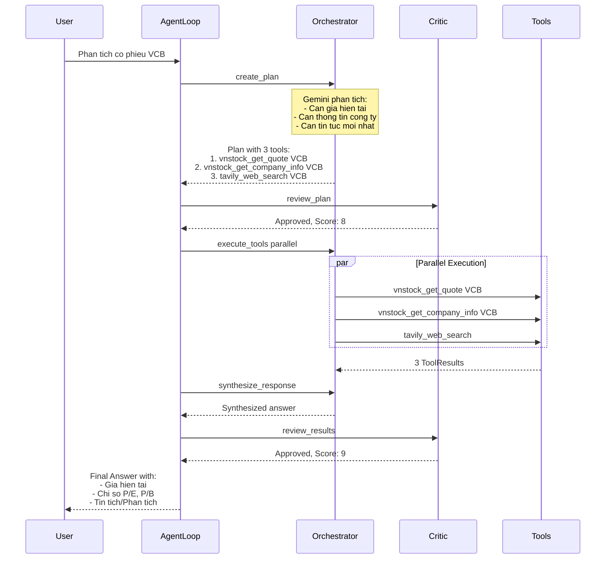

---

## 6. Co che Iteration

Khi Critic tu choi, he thong se lap lai voi feedback:

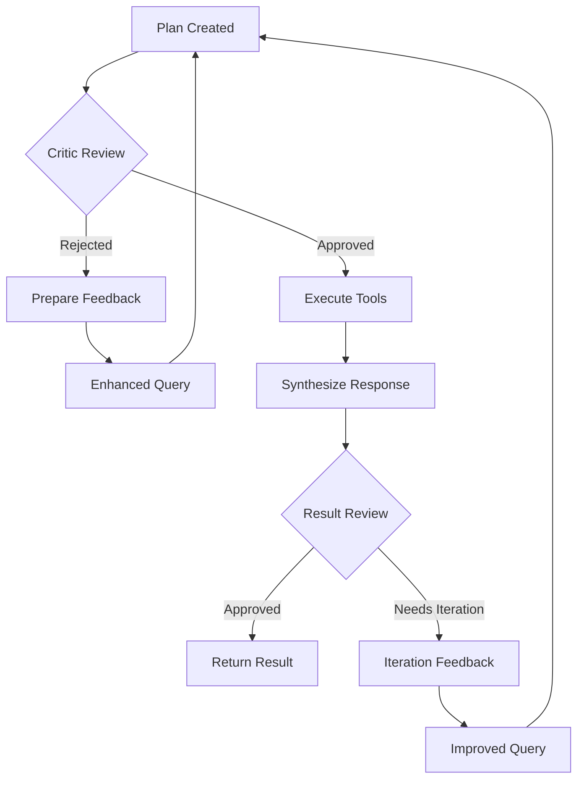

**Feedback Enhancement:**
```python
# Plan rejected
enhanced_query = f"Yeu cau goc: {original_query}\n\n
                   Ke hoach truoc chua dat. Phan hoi: {feedback}\n\n
                   Hay tao ke hoach moi tot hon."

# Results need iteration
improved_query = f"Yeu cau goc: {original_query}\n\n
                   Ket qua chua dat yeu cau. Phan hoi: {feedback}\n\n
                   Hay thu cach tiep can khac."
```

---

## 7. Metrics & Monitoring

**AgentLoopResult Metrics:**

| Metric | Mo ta |
|--------|-------|
| latency_ms | Thoi gian thuc thi tong |
| tokens | Tong so token su dung |
| accuracy | Diem trung binh tu Critic (scale 0-100) |

**Token Tracking:**
- Orchestrator tokens: input + output
- Critic tokens: input + output
- Total = Orchestrator + Critic

---

## 8. Luu tru Du lieu & Tai su dung

### 8.1 Dau duoc luu?

**Tool Results duoc luu trong:**

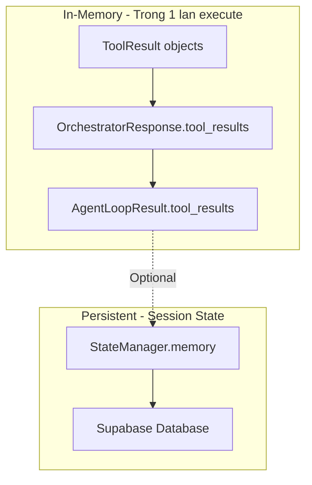

**Cac vi tri luu tru:**

| Vi tri | Pham vi | Noi dung |
|--------|---------|----------|
| [`ToolResult`](src/agents/orchestrator.py:49) | Trong 1 iteration | Ket qua tu 1 tool |
| [`OrchestratorResponse.tool_results`](src/agents/orchestrator.py:65) | Trong 1 iteration | List ket qua tu tat ca tools |
| [`AgentLoopResult.tool_results`](src/agents/agent_loop.py:45) | Tra ve cho user | Tat ca tool results cuoi cung |
| [`StateManager.memory`](src/agents/state/manager.py:147) | Cross-session | Co the luu, nhung **Hien chua duoc su dung** |

### 8.2 Du lieu cu co duoc tai su dung?

**TRANG THAI HIEN TAI: KHONG TAI SU DUNG**

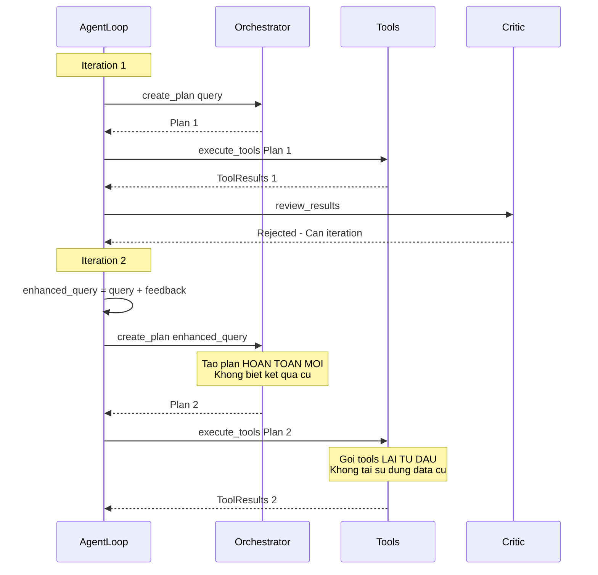

**Van de hien tai:**

```python
# agent_loop.py - Dong 126
user_query = f"Yêu càu góc: {user_query}\n\nKê hoach truóc chua dat. Phan hoi: {feedback}\n\nHãy tao kê hoach mói tót hon."
# Chi truyen feedback text, KHONG truyen tool_results cu
```

### 8.3 Hieu ung cua viec khong tai su dung

| Tinh huong | Hanh vi hien tai | Van de |
|------------|------------------|---------|
| Tool 1 thanh cong, Tool 2 that bai | Goi LAI ca Tool 1 va Tool 2 | Lang phi API calls |
| Tool 1 tra ve data tot, nhung Critic muon phan tich sau | Goi lai Tool 1 | Duplicate work |
| Can them thong tin moi | Goi lai tat ca tools | Khong optimize |

### 8.4 De xuat cai thien

**Cach 1: Tool Result Caching**

```python
class AgentLoop:
    def __init__(self):
        self.tool_cache: Dict[str, ToolResult] = {}  # Cache by tool_name + params hash
    
    async def execute_with_cache(self, plan):
        results = []
        for tool in plan.tools:
            cache_key = f"{tool.tool_name}:{hash(frozenset(tool.parameters.items()))}"
            if cache_key in self.tool_cache:
                results.append(self.tool_cache[cache_key])  # Reuse
            else:
                result = await self._execute_single_tool(tool)
                self.tool_cache[cache_key] = result
                results.append(result)
        return results
```

**Cach 2: Pass Previous Results to Orchestrator**

```python
# Trong agent_loop.py
if result_review.requires_changes:
    # Truyen kem ket qua cu cho Orchestrator
    context = {
        "previous_results": tool_results,
        "feedback": result_review.iteration_feedback
    }
    plan = await self.orchestrator.create_plan(user_query, context)
```

**Cach 3: StateManager Memory Usage**

```python
# Luu tool results vao session memory
await self.state_manager.add_to_memory(
    session_id, 
    f"tool_results_iter_{current_iteration}", 
    tool_results
)

# Lay ra khi can
previous_results = await self.state_manager.get_from_memory(
    session_id,
    f"tool_results_iter_{current_iteration - 1}"
)
```

### 8.5 Tong ket ve Data Flow

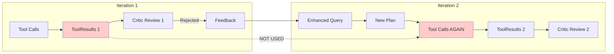

**Ket luan:** Hien tai, du lieu tu tools KHONG duoc tai su dung giua cac iterations. Moi iteration la "clean slate" - goi lai tools tu dau.

---

## 9. Tong ket

He thong Multi-Agent nay hoat dong theo mo hinh **Plan-Execute-Review-Iterate**:

1. **Orchestrator** phan tich yeu cau va lap ke hoach su dung tools
2. **Critic** danh gia ke hoach truoc khi thuc thi
3. **Tools** duoc thuc thi song song/tuan tu
4. **Critic** danh gia ket qua sau thuc thi
5. **AgentLoop** dieu phoi vong lap cho den khi dat ket qua tot hoac het iterations

Diem noi bat cua he thong:
- **Freshness Audit**: Dam bao khong dung kien thuc cu cho du lieu tai chinh
- **Parallel Execution**: Tang toc do thuc thi
- **Self-Correction**: Tu cai thien qua iteration
- **State Persistence**: Luu trang thai vao Supabase